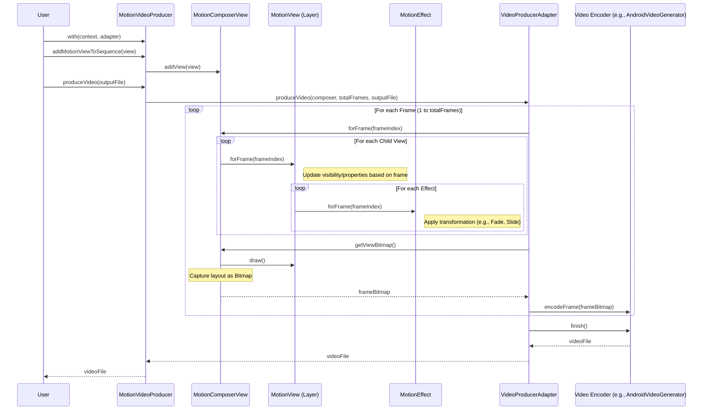

# Video Generation Architecture

This diagram illustrates the interaction between key classes in the `motionlib` library during the video generation process, starting from the high-level `MotionVideoProducer` down to the `VideoProducerAdapter`.

## Architecture Diagram

## Key Components

### [MotionVideoProducer](file:///Users/tejpratapsingh/Desktop/Projects/Android/AndroidVideoMotion/modules/motionlib/src/main/java/com/tejpratapsingh/motionlib/core/motion/MotionVideoProducer.kt)
The primary entry point for developers. It orchestrates the building of the video sequence and initiates the production process.

### [MotionComposerView](file:///Users/tejpratapsingh/Desktop/Projects/Android/AndroidVideoMotion/modules/motionlib/src/main/java/com/tejpratapsingh/motionlib/core/motion/MotionComposerView.kt)
A specialized `ViewGroup` (extending `ContourLayout`) that serves as the "stage" where all `MotionView` layers are added. It handles recursive frame updates and rendering to a bitmap.

### [MotionView](file:///Users/tejpratapsingh/Desktop/Projects/Android/AndroidVideoMotion/modules/core/src/main/java/com/tejpratapsingh/motionlib/core/MotionView.kt)
An interface for any visual component in the video. It defines its lifecycle in terms of frames (`startFrame`, `endFrame`) and how it reacts to specific frame indices.

### [VideoProducerAdapter](file:///Users/tejpratapsingh/Desktop/Projects/Android/AndroidVideoMotion/modules/core/src/main/java/com/tejpratapsingh/motionlib/core/VideoProducerAdapter.kt)
An abstraction for the video encoding process. Different implementations allow for using different backends like:
*   **Android MediaCodec** (via `AndroidVideoProducerAdapter`)
*   **FFmpeg** (via `FfmpegVideoProducerAdapter`)
*   **JCodec** (via `JCodecVideoProducerAdapter`)
*   **Media3 Transformer** (via `Media3VideoProducerAdapter`)

## Production Flow Summary
1.  **Orchestration**: `MotionVideoProducer` delegates the heavy lifting to the `VideoProducerAdapter`.
2.  **Frame Stepping**: The adapter iterates through every frame of the video.
3.  **Scene Composition**: For each frame, `MotionComposerView` updates all child layers and effects.
4.  **Rasterization**: The composed scene is converted into a `Bitmap`.
5.  **Encoding**: The `Bitmap` is sent to the encoder to be appended to the video stream.
